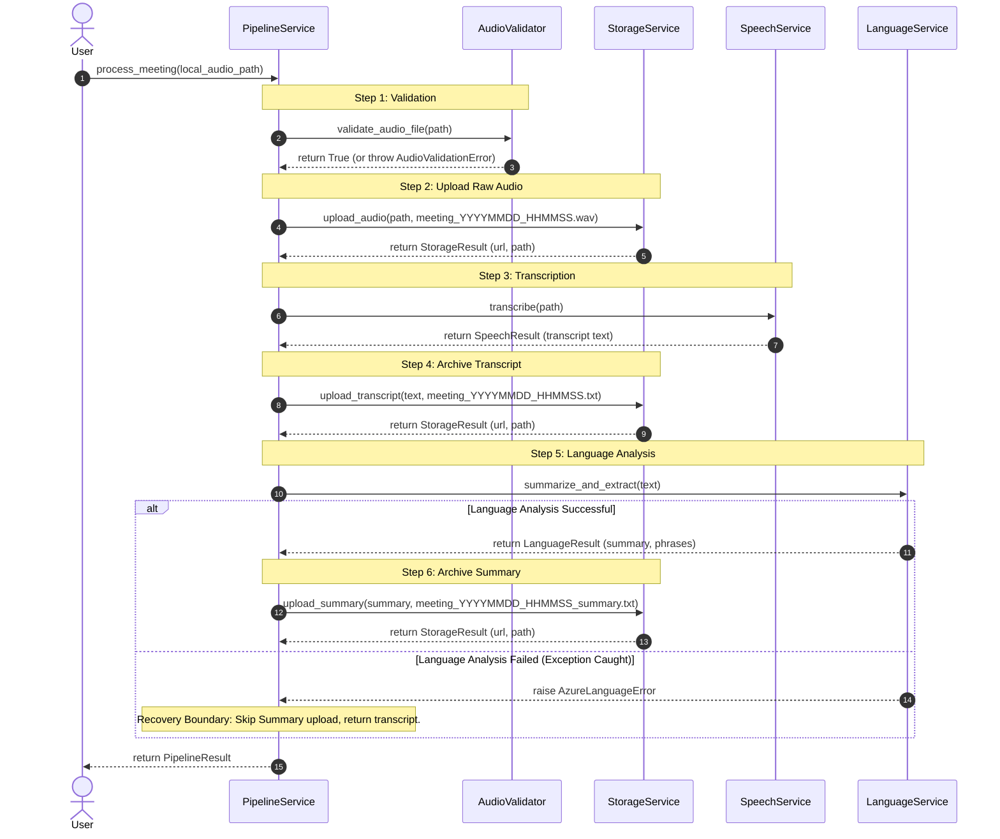

# Voice-Enabled Meeting Transcription and Summarization Assistant

A professional, production-grade Streamlit web application integrated with Microsoft Azure AI Services to transcribe meeting recordings, generate key summaries, extract key discussion points, and archive files in Azure Blob Storage.

---

## 📋 Table of Contents
1. [Project Overview](#-project-overview)
2. [Prerequisites](#-prerequisites)
3. [Azure Service Provisioning](#-azure-service-provisioning)
4. [Environment Setup](#-environment-setup)
5. [Installation & Local Deployment](#-installation--local-deployment)
6. [Pipeline Architecture & Sequence Flow](#-pipeline-architecture--sequence-flow)
7. [Testing Guide](#-testing-guide)
8. [Language Module Technical Specifications](#-language-module-technical-specifications)
9. [Responsible AI Checklist](#-responsible-ai-checklist)
10. [Troubleshooting Guide](#-troubleshooting-guide)

---

## 🔍 Project Overview
This project is built as part of the Microsoft Azure AI Fundamentals (AI-900) curriculum. It demonstrates the cloud orchestrations of prebuilt PaaS/SaaS AI cognitive models:
* **Speech to Text:** Azure AI Speech SDK performs batch/continuous transcription.
* **Text Analytics:** Azure AI Language Document Summarization extracts executive summaries and key phrases.
* **Storage and Archiving:** Azure Blob Storage holds audio files, transcripts, and summary reports under virtual folder prefixes in a private container.

---

## ⚙️ Prerequisites
Ensure you have the following software installed:
* **Python 3.11+**
* **Azure CLI**
* **Git**
* Active **Azure Subscription** (Student/Free Tier)
* **GStreamer Codecs (Linux Deployments only):** The Azure Speech SDK requires GStreamer for parsing compressed audio formats (like `.mp3` and `.m4a`) on Linux platforms.
  - **Ubuntu/Debian:** `sudo apt-get update && sudo apt-get install -y libgstreamer1.0-0 gstreamer1.0-plugins-base gstreamer1.0-plugins-good gstreamer1.0-plugins-bad gstreamer1.0-plugins-ugly`
  - **Fedora/CentOS/RHEL:** `sudo dnf install gstreamer1 gstreamer1-plugins-base gstreamer1-plugins-good gstreamer1-plugins-bad-free gstreamer1-plugins-ugly-free`
  - *Note:* Standard uncompressed `.wav` files are processed natively by the Speech SDK on all platforms without external GStreamer configurations.

---

## 🛠️ Azure Service Provisioning
Follow CAF naming conventions to provision the following resources:
1. **Resource Group:** `rg-meetingassistant-prod-eastus-001`
2. **Azure AI Speech:** `cog-speech-meetingassistant-prod-eastus-001` (F0 pricing)
3. **Azure AI Language:** `cog-lang-meetingassistant-prod-eastus-001` (F0 pricing)
4. **Storage Account:** `stmeetingassistantprod001` (LRS, Hot tier)
5. **Storage Container:** Create container named `meeting-data` with Private Access.

---

## 🔑 Environment Setup
1. Copy the environment template:
   ```bash
   cp .env.example .env
   ```
2. Open `.env` and fill in the subscription credentials from the Azure Portal.

---

## 🚀 Installation & Local Deployment
1. Initialize the virtual environment:
   ```bash
   python -m venv .venv
   source .venv/bin/activate  # On Windows: .venv\Scripts\activate
   ```
2. Install dependencies:
   ```bash
   pip install -r requirements.txt
   ```
3. Run the Streamlit application (once UI is implemented):
   ```bash
   streamlit run app/main.py
   ```

---

## 🔗 Pipeline Architecture & Sequence Flow

The `PipelineService` orchestrates the complete lifecycle of a meeting processing request, starting from a local audio file and outputting a structured `PipelineResult` with cloud storage targets.



### Pipeline Error Recovery Rules
* **Speech/Storage Failures:** Fatal. If local validation, raw audio upload, speech transcription, or transcript upload fails, processing stops immediately and the error is returned to prevent incomplete records.
* **Language Failures:** Non-fatal. If key phrase extraction or summarization fails (due to regional unsupported actions or API limits), the pipeline catches the exception, skips the summary upload, and returns `success=True` containing the full transcription and a warning status.

---

## 🧪 Testing Guide

To verify the Speech, Language, Storage, and Pipeline integration services offline, execute the test suite:
```bash
# Run all tests (Speech, Language, Storage, Pipeline)
python -m unittest discover -s tests

# Run Pipeline tests only
python -m unittest tests/test_pipeline.py

# Run Storage tests only
python -m unittest tests/test_storage.py

# Run Language tests only
python -m unittest tests/test_language.py

# Run Speech tests only
python -m unittest tests/test_speech.py
```
This unit test utilizes MagicMocks to simulate speech transcription, silent recordings, text analysis, regional summarization limitations, and Azure SDK HTTP errors, allowing you to validate module mechanics without incurring Azure transaction costs.

---

## 📄 Language Module Technical Specifications
* **Module Path:** `services/language_service.py`
* **Response Class:** `LanguageResult` wrapping `success`, `summary`, `key_phrases`, `processing_time`, `error_message`, `language`, and `status` fields.
* **Supported Operations:** 
  1. **Key Phrase Extraction:** Identifies significant conversational tokens, filters out duplicates, and ignores empty strings while preserving the logical flow.
  2. **Document Summarization:** Submits transcripts for extractive summarization to create a concise meeting overview.
* **Graceful Fallback Mode:** In regions or pricing tiers (like Free F0) where document summarization is unsupported or disabled, the module automatically catches the SDK exception and falls back to a local parser (extracting the first two sentences of the transcript). This prevents application crashes and preserves usability.
* **Limitations:** Maximum input text length is capped at **100,000 characters** to protect against API character limits. None, empty, or whitespace-only inputs trigger a `LanguageValidationError`.

---

## 🛡️ Troubleshooting Guide

### 1. Azure AI Speech & Configuration Issues

* **ConfigurationError: AZURE_SPEECH_KEY environment variable is missing.**
  * *Cause:* The system failed to load your Speech subscription key.
  * *Fix:* Verify that your `.env` file exists in the project root (copied from `.env.example`) and is populated correctly.

* **ConfigurationError: AZURE_SPEECH_KEY must be a valid 32-character key.**
  * *Cause:* Key is cut off or incorrect.
  * *Fix:* Copy Key 1 directly from the "Keys and Endpoint" panel of your Azure Speech Resource and paste it into `.env`.

* **Azure Speech Connection validation failed: Authentication Error.**
  * *Cause:* Incorrect key or region combination.
  * *Fix:* Verify that `AZURE_SPEECH_REGION` matches the location of the resource (e.g., `eastus`) and key matches.

* **Quota Exceeded / Free Tier Limits.**
  * *Cause:* Exceeded 5 hours of audio transcription for the month.
  * *Fix:* Check usage in Azure Cost Management. You will need to wait for the monthly cycle reset or temporarily upgrade the service resource to the Standard S0 pricing tier.

### 2. Azure AI Language Issues

* **Azure Language Connection verification failed: Access denied.**
  * *Cause:* Incorrect language subscription key or mismatched region endpoint.
  * *Fix:* Copy Key 1 and the Endpoint URL from your Azure Language Resource under the "Keys and Endpoint" panel and update your `.env` settings.

* **AI Summary (Local Fallback) is displayed in results.**
  * *Cause:* The Azure AI Language resource is in a region that does not support document summarization actions, or the pricing tier (F0) lacks summarization authorization.
  * *Fix:* This is normal operational fallback behavior. To enable full abstractive/extractive summarization, redeploy the Language service in a region like `eastus` or use the `S0` (Standard) tier.

* **Language Input Validation Error: Transcript exceeds maximum supported length.**
  * *Cause:* Input text exceeds the 100,000 character limit.
  * *Fix:* Split your text or upload a shorter recording.

### 3. Audio & File Errors

* **Audio File Error: Unsupported audio format.**
  * *Cause:* The uploaded file extension is not `.wav`, `.mp3`, or `.m4a`.
  * *Fix:* Convert the meeting audio file into a supported format before uploading.

* **Audio File Error: File size exceeds maximum allowed size.**
  * *Cause:* File size is larger than 50MB.
  * *Fix:* Compress the audio or split the recording into smaller parts before uploading.

* **Audio File Error: Audio file is completely empty (0 bytes).**
  * *Cause:* The file was corrupted or recorded incorrectly.
  * *Fix:* Re-record the audio or try another test file.

* **Network connection lost / Timeouts.**
  * *Cause:* Intermittent internet connection drop.
  * *Fix:* The backend will automatically retry 3 times using exponential backoff. If it still fails, check your local router or proxy settings.

---

## ☁️ Streamlit Community Cloud Deployment

Follow these instructions to deploy the Meeting Assistant to **Streamlit Community Cloud** in a few clicks:

### 1. Push Code to GitHub
Ensure all local modifications are committed and pushed to your public or private GitHub repository.

### 2. Launch Streamlit Community Cloud App Creation
1. Go to [share.streamlit.io](https://share.streamlit.io) and sign in using your GitHub credentials.
2. Click **New app** on your workspace dashboard.
3. Select your repository, specify the target branch, and input the main file path:
   - **Main file path:** `app/main.py`

### 3. Configure Streamlit Secrets
1. Before deploying, click **Advanced settings...** at the bottom of the page.
2. In the **Secrets** section, copy, paste, and customize the TOML template below:

```toml
AZURE_SPEECH_KEY = "your_84_character_azure_speech_key"
AZURE_SPEECH_REGION = "eastus"
AZURE_LANGUAGE_KEY = "your_32_character_azure_language_key"
AZURE_LANGUAGE_ENDPOINT = "https://cog--lang.cognitiveservices.azure.com/"
AZURE_STORAGE_CONNECTION_STRING = "DefaultEndpointsProtocol=https;AccountName=your_account;AccountKey=your_key;EndpointSuffix=core.windows.net"
BLOB_CONTAINER_NAME = "meeting-data"
```

3. Click **Save** to apply the configuration.
4. Click **Deploy!** to start the build. The cloud server will install all dependencies declared in `requirements.txt` (including `av` and `reportlab`) and launch the meeting assistant.

